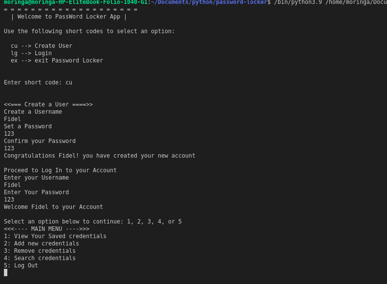
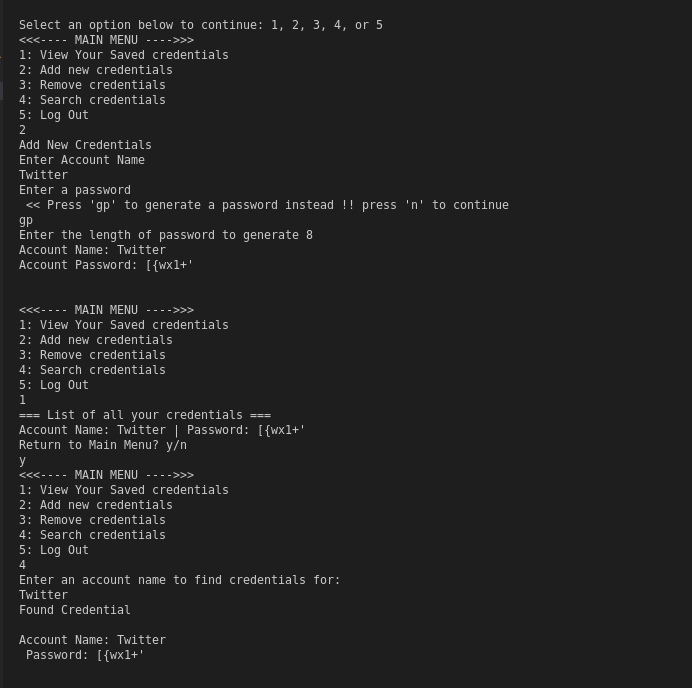

# Password - Locker

This project was generated using Python 3.9

## Author

[FidelMunywoki](https://github.com/FidelMunywoki)

### Version
08.2021/01.0

## Description

This a python app that allows you to login and store your password for your online accounts, you can generate password also. 

## User Stories

As user I would like to:

   * Create an account or login the application
   * Store my credentials for different accounts
   * Generate new password for accounts not registered
   * Delete stored account login

## Screen Shot
### login

### main menu

## Installation / Setup instruction

1. python3.9
2. pyperclip
3. pip

### clone
* clone https://github.com/FidelMunywoki/password-locker.git
* cd password-locker
* open with text editor

### Run application

* On the terminal
    $ chmod +x run.py
    $ ./run.py
* Or use code runer extension i Visual studio

## Behaviour Driven Development

| Behaviour      | Input        | Output       |
| :------------- | :----------: | -----------: |
|  Open The applicaton  |   ./run.py |   Welcome to Password Locker App   |
| select Option  | select cu |  Congratulations username your account has been created  |
| login   |  username, password  |  You have successfully Login    |
| select toppings  |  check all the topppings you want     | welcome to your account    |
| select an option | 1,2,3,4,5     | |
| select 1 | 1   | credentials list|
| select 2 | 2    | Add new Credentials >> Credentials has been generated successfully |
| select 3|  3 |   Remove credentials >> Credebtial has deleted sucessfully |
| select 4 | 4     | Search Credentals >> Found Credential |
| select 5|  5| Log Out|
| select an Option lg|  testuser, 12345| You have successfully login |
| select an Option ex|  ex| exist Password Locker App|

## Technologies Used

* Python

## Known Bugs

* Not any as of the time it was updated

## Contact Information 

If you have any question or contributions that would better this app, please email me at [fidelis.munywoki@student.moringaschool.com]

## License
* *MIT License:*
* Copyright (c) 2021 **Fidel Munywoki**